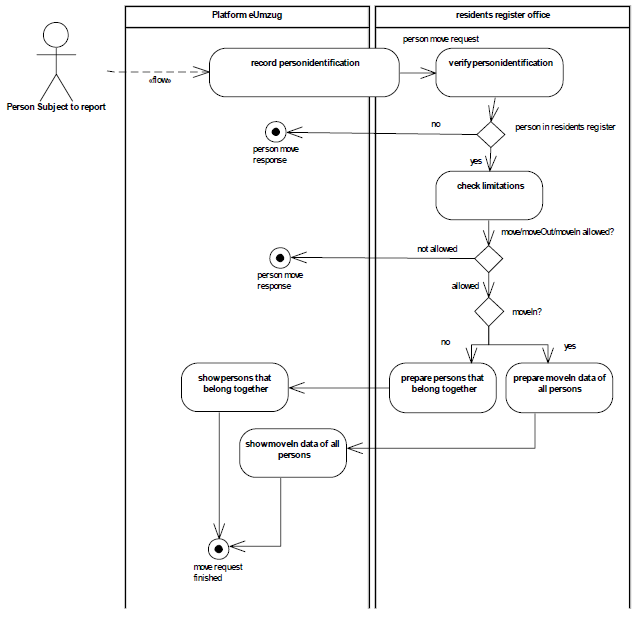
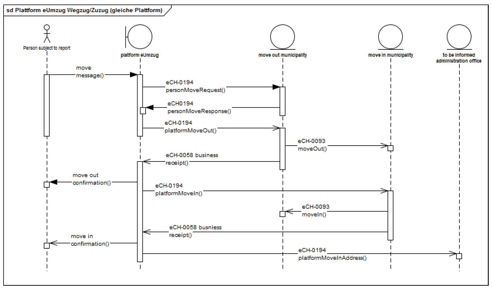
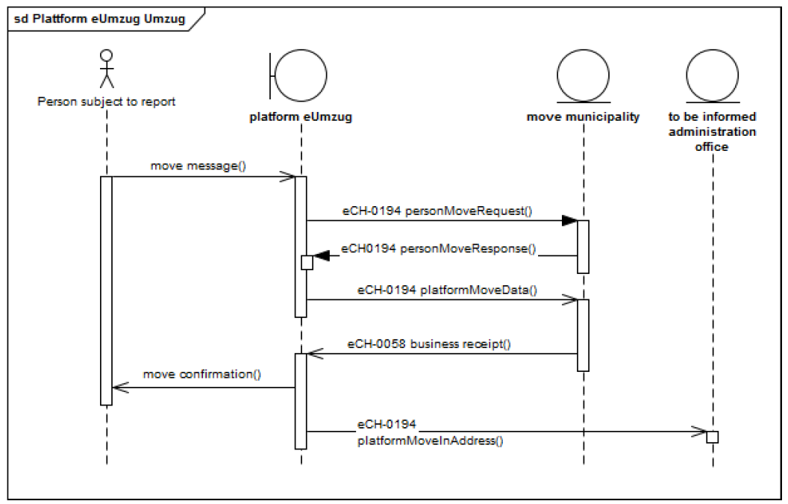
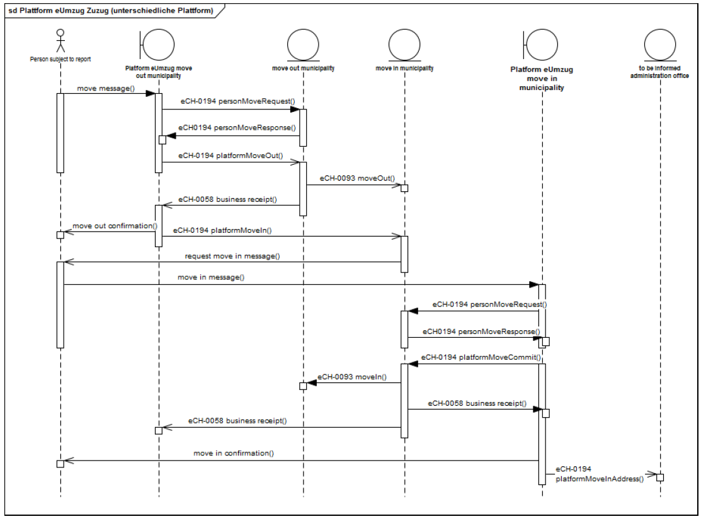
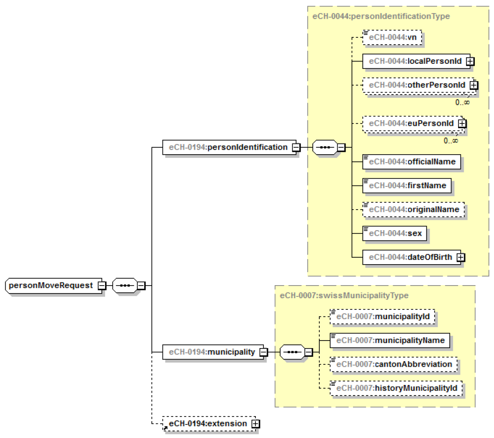

# eCH-0194 Schnittstellenstandard eUmzug

```
- TODO: Add capitel reference
```

## Einleitung
* Personenidentifikation erfolgt synchron
* Wir implementieren keine Anbindung an Sedex.
	* Stattdesssen simulieren wir vereinfacht zwei EK-Systeme und damit eigentlich nur zwei Gemeinden, welche je per Webservice ansprechbar sind.
	* Damit die Tests aber trotzdem für alle Gemeinden des Kantons Bern durchlaufen, wird einfach jeder Gemeinde einer dieser zwei Webservices zugewiesen. Diese Zuweisung der Webservices ist ebenfalls in der Tabelle mit allen Gemeinden aufgeführt.

## Grundsätze
* Bezüglich Meldung von Ereignissen zwischen Umzugsplattform und den Einwohnerdiensten (Einwohnerregister):
	* TODO: siehe Req-Nummmern -> In Requirements aufnehmen
	* **ZWINGEND**	Jede Ereignismeldung wird zusammen mit generellen Informationen gemeldet. Die generellen Informationen sind in [eCH-0058] beschrieben.
	* **ZWINGEND**	Die Gemeindeindentifikation (municipalityId) des eCH-0007 ist im Kon-text des Umzugs immer zu liefern.
	* **ZWINGEND**	Im Kontext von eUmzug sind die Informationen zu den Kontaktdaten (Email und Telefonnummer) zwingend zu liefern.
	* **ZWINGEND** 	Im Kontext von eUmzug ist bei allen Meldungen – mit Ausnahme von Umzugsanfrage/Umzugsantwort (Kapitel 3.2.1) und Plattform Zuzugsadresse (Kapitel 3.2.5) - die Geschäftsfall-Identifikation im Header eCH-0058:headerType:businessProcessId mitzugeben. Dies gilt auch für die abhängigen eCH-0093 Meldungen.
	* **ZWINGEND** 	Im Kontext von eUmzug muss die Geschäftsfall-Identifikation -businessProcessID mit folgendem Präfix übergeben werden „EUMZUG“
	* **ZWINGEND** 	Damit, vor allem bei Umzügen über mehrere Umzugsplattformen, die Zuzugsgemeinde eruieren kann ob der Prozess vollständig abgeschlossen ist, muss die letzte Meldung des Gesamt-Umzugsprozesses mittels eCH-0058:headerType:businessCaseClosed = true als solche gekennzeichnet werden.

### Fachliche Quittierung
Die Detail-Prozesse auf Anwendungsebene für das Übermitteln und Konsumieren von Ereignismeldungen sind in [eCH-0058] beschrieben.
Die fachliche Quittierung erfolgt mittels eCH-0058 eventReport. Dabei kann es sich um eine positive oder eine negative Quittung handeln.

### Angabe von Identifikation für Personen
_Personenidentifikation_ meint:

* Name
* Vorname(n)
* Geschlecht
* Geburtsdatum

### Lieferung von zusätzlichen Dokumenten
Vereinfachungen gemäss Björn:
* Zusätzliche Dokumente können zwar hochgeladen werden und werden in der Umzugsplattform (also auf dem Camunda-Server) gespeichert, nicht aber per Web Service (SOAP) an die EK-Systeme geliefert.
* Weil wir auf Sedex verzichten, ist die eCH-0194-Meldung einfacher aufgebaut, nämlich direkt als SOAP-Message.

## Spezifikation
* Im Rahmen des elektronischen Umzuges muss die Umzugsplattform zur Initialisierung des Prozesses die Identifikation eines Meldepflichtigen synchron durchführen können und prü-fen, ob der Meldepflichtige in der entsprechenden Gemeinde (Einwohnerregister des Ein-wohnerdienstes) vorhanden ist und ob der Meldepflichtige eine Umzugsmeldung durchführen darf.
* Nach der Identifikation erfasst der Meldepflichtige die benötigten Daten auf der Umzugsplatt-form. Nach der Erfassung werden die Daten in Form von Meldungen asynchron an die Wegzugsgemeinde (Umzugsgemeinde) übermittelt und gemäss eCH-0093 verarbeitet.

### Umzugsanfrage



### Prozess beim Wegzug / Zuzug via Umzugsplattform



Die Person meldet sich bei der Umzugsplattform an und erfasst die notwendigen Daten für den Umzug innerhalb der Gemeinde (move message).

* **ZWINGEND** Die Umzugsplattform macht eine Umzugsanfrage bei der Umzugsgemeinde (eCH-0194:personMoveRequest). Die Umzugsgemeinde beantwortet diese mittels Umzugs-antwort (eCH-0194:personMoveResponse).
* **ZWINGEND** Die Umzugsplattform meldet der Wegzugsgemeinde die Angaben zur Person sowie die von der Person erfassten Zusatzdaten (eCH-0194:platformMoveOut). Siehe Kapi-tel 3.2.2.
* **ZWINGEND** Die Einwohnerdienste bestätigen der Umzugsplattform, dass der Wegzug der Zuzugsgemeinde gemeldet worden ist (eCH-0058:business receipt).
* **ZWINGEND** Die Umzugsplattform bestätigt der meldepflichtigen Person den Wegzug (mo-ve out confirmation)
* **ZWINGEND** Die Umzugsplattform meldet der Zuzugsgemeinde die Angaben zur Person sowie die von der Person erfassten Zusatzdaten (eCH-0194:platformMoveIn). Siehe Kapitel 3.2.3. Die Umzugsplattform signalisiert der Zuzugsgemeinde (eCH-0058:header:businessCaseClosed = true) dass keine weiteren Meldungen mehr von der Umzugsplattform folgen und der Zuzug aus Sicht der Umzugsplattform abgeschlossen ist (alles gemeldet und - sofern relevant - bezahlt).
* **ZWINGEND** Die Einwohnerdienste der Zuzugsgemeinde bestätigen der Umzugsplattform den erfolgten Zuzug (eCH-0058: business receipt).
* **ZWINGEND** Die Umzugsplattform bestätigt der Person den erfolgten Zuzug. Per Mail (Anmerkung von Björn)

### Prozess beim Umzug via Umzugsplattform



* **ZWINGEND** Die Umzugsplattform macht eine Umzugsanfrage bei der Umzugsgemeinde (eCH-0194:personMoveRequest). Die Umzugsgemeinde beantwortet diese mittels Umzugs-antwort (eCH-0194:personMoveResponse).
* **ZWINGEND** Die Umzugsplattform meldet der Umzugsgemeinde die Angaben zur Person sowie die von der Person erfassten Zusatzdaten (eCH-0194:platformMoveData). Siehe Kapi-tel 3.2.4 Die Umzugsplattform signalisiert der Umzugsgemeinde (eCH-0058:header:businessCaseClosed = true) dass keine weiteren Meldungen mehr von der Umzugsplattform folgen und der Umzug aus Sicht der Umzugsplattform abgeschlossen ist (alles gemeldet und - sofern relevant - bezahlt).
* **ZWINGEND** Die Umzugsgemeinde bestätigt der Umzugsplattform den Umzug (eCH-0058 business receipt).
* **ZWINGEND** Die Umzugsplattform bestätigt der Person den erfolgten Umzug (move confirmation). Per Mail (Anmerkung von Björn)

### Prozess beim Zuzug via Umzugsplattform



* **ZWINGEND** Die Umzugsplattform macht eine Umzugsanfrage bei der Wegzugsgemeinde (eCH-0194:personMoveRequest). Die Wegzugsgemeinde beantwortet diese mittels Um-zugsantwort (eCH-0194:personMoveResponse).
* **ZWINGEND** Die Umzugsplattform meldet der Wegzugsgemeinde die Angaben zur Person sowie die von der Person erfassten Zusatzdaten (eCH-0194:platformMoveOut). Siehe Kapi-tel 3.2.2.
* **ZWINGEND** Die Einwohnerdienste der Wegzugsgemeinde melden der Zuzugsgemeinde den Wegzug (eCH-0093:moveOut). Siehe eCH-0093.
* **ZWINGEND** Die Einwohnerdienste der Wegzugsgemeinde bestätigen der Umzugsplatt-form, dass der Wegzug der Zuzugsgemeinde gemeldet worden ist (eCH-0058 business re-ceipt). Die Umzugsplattform der Wegzugsgemeinde bestätigt der Person den erfolgten Wegzug (move out confirmation).
* **ZWINGEND** Die Umzugsplattform meldet der Zuzugsgemeinde die Angaben zur Person sowie die von der Person erfassten Zusatzdaten (eCH-0194:platformMoveIn). Siehe Kapitel 3.2.3
* **EMPFOHLEN** Die Zuzugsgemeinde fordert den Meldepflichtigen zur Bestätigung des Zu-zugs auf (request move in message).
* **EMPFOHLEN** Der Meldepflichtige prüft die Daten auf der Umzugsplattform, wählt Dienste aus und schliesst den Zuzug ab (move in message).
* **ZWINGEND** Die Umzugsplattform macht eine Umzugsanfrage bei der Zuzugsgemeinde (eCH-0194:personMoveRequest). Die Zuzugsgemeinde beantwortet diese mittels Umzugs-antwort (eCH-0194:personMoveResponse).
* **ZWINGEND** Die Umzugsplattform bestätigt der Zuzugsgemeinde den Abschluss des Zu-zugs (eCH-0194:platformMoveComit). Siehe Kapitel 3.2.6 Die Umzugsplattform signalisiert der Zuzugsgemeinde (eCH-0058:header:businessCaseClosed = true) dass keine weiteren Meldungen mehr von der Umzugsplattform folgen und der Zuzug aus Sicht der Umzugsplattform abgeschlossen ist (alles gemeldet und - sofern relevant - bezahlt).
* **ZWINGEND** Die Einwohnerdienste der Zuzugsgemeinde melden der Wegzugsgemeinde den Zuzug (eCH-0093:moveIn). Siehe eCH-0093.
* **ZWINGEND** Die Einwohnerdienste der Zuzugsgemeinde quittieren den beteiligten Um-zugsplattformen den Abschluss (eCH-0058: business receipt)
Die Umzugsplattform der Zuzugsgemeinde bestätigt der Person den erfolgten Zuzug (move in confirmation).
* **EMPFOHLEN** Die Umzugsplattform der Zuzugsgemeinde meldet die Zuzugsadresse an berechtigte Verwaltungsstellen (Bsp. VeKa). Siehe Kapitel 3.2.5

## 3.2 Ereignismeldungen

### 3.2.1 Umzugsanfrage/Umzugsantwort

#### 3.2.1.1 Umzugsanfrage - personMoveRequest (synchron)

**Ereignisbeschreibung**
Die Umzugsplattform fragt bei den Einwohnerdiensten an ob die Person bekannt ist, ob sie umziehen darf und ob es sich um einen Umzug, Wegzug oder um einen Zuzug handelt.

**Ereignisdaten**
Folgende Informationen zur Person sind zu übermitteln:
* Personenidentifikatoren (zwingend) – personIdentification, siehe eCH-0044
* Gemeinde (zwingend) – municipality, siehe eCH-0007
* Erweiterung (optional) – extension, siehe Kapitel 3.2.6.9



#### 3.2.1.2 Umzugsantwort - personMoveResponse

**Ereignisbeschreibung**
Die Einwohnerdienste beantworten die Anfrage der Umzugsplattform mit folgenden Informationen:

* 1 = Wegzug / Umzug erlaubt
* 2 = Wegzug / Umzug nicht erlaubt
