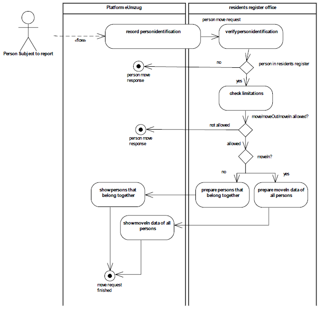
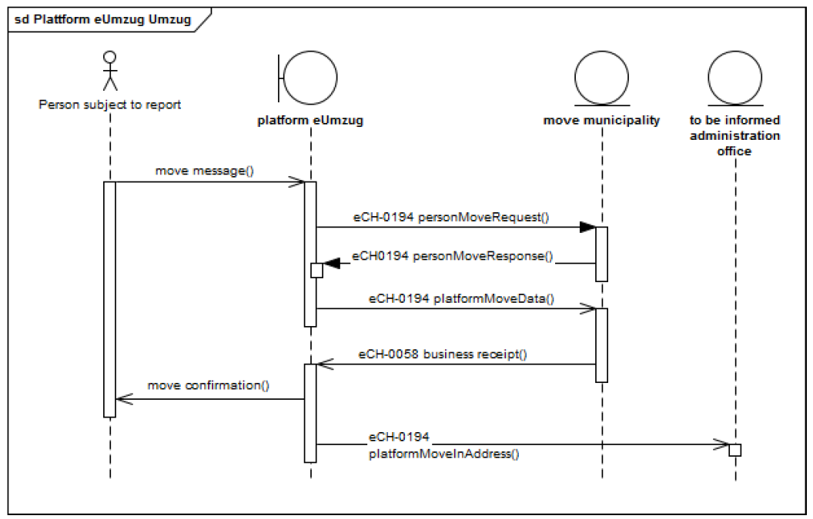

# eCH-0194 Schnittstellenstandard eUmzug

## Einleitung
* Personenidentifikation erfolgt synchron
* Wir implementieren keine Anbindung an Sedex.
	* Stattdesssen simulieren wir vereinfacht zwei EK-Systeme und damit eigentlich nur zwei Gemeinden, welche je per Webservice ansprechbar sind.
	* Damit die Tests aber trotzdem für alle Gemeinden des Kantons Bern durchlaufen, wird einfach jeder Gemeinde einer dieser zwei Webservices zugewiesen. Diese Zuweisung der Webservices ist ebenfalls in der Tabelle mit allen Gemeinden aufgeführt.

## Grundsätze
* Bezüglich Meldung von Ereignissen zwischen Umzugsplattform und den Einwohnerdiensten (Einwohnerregister):
	* TODO: siehe Req-Nummmern -> In Requirements aufnehmen
	* **ZWINGEND**	Jede Ereignismeldung wird zusammen mit generellen Informationen gemeldet. Die generellen Informationen sind in [eCH-0058] beschrieben.
	* **ZWINGEND**	Die Gemeindeindentifikation (municipalityId) des eCH-0007 ist im Kon-text des Umzugs immer zu liefern.
	* **ZWINGEND**	Im Kontext von eUmzug sind die Informationen zu den Kontaktdaten (Email und Telefonnummer) zwingend zu liefern.
	* **ZWINGEND** 	Im Kontext von eUmzug ist bei allen Meldungen – mit Ausnahme von Umzugsanfrage/Umzugsantwort (Kapitel 3.2.1) und Plattform Zuzugsadresse (Kapitel 3.2.5) - die Geschäftsfall-Identifikation im Header eCH-0058:headerType:businessProcessId mitzugeben. Dies gilt auch für die abhängigen eCH-0093 Meldungen.
	* **ZWINGEND** 	Im Kontext von eUmzug muss die Geschäftsfall-Identifikation -businessProcessID mit folgendem Präfix übergeben werden „EUMZUG“
	* **ZWINGEND** 	Damit, vor allem bei Umzügen über mehrere Umzugsplattformen, die Zuzugsgemeinde eruieren kann ob der Prozess vollständig abgeschlossen ist, muss die letzte Meldung des Gesamt-Umzugsprozesses mittels eCH-0058:headerType:businessCaseClosed = true als solche gekennzeichnet werden.

### Fachliche Quittierung
Die Detail-Prozesse auf Anwendungsebene für das Übermitteln und Konsumieren von Ereignismeldungen sind in [eCH-0058] beschrieben.
Die fachliche Quittierung erfolgt mittels eCH-0058 eventReport. Dabei kann es sich um eine positive oder eine negative Quittung handeln.

### Angabe von Identifikation für Personen
_Personenidentifikation_ meint:

* Name
* Vorname(n)
* Geschlecht
* Geburtsdatum

### Lieferung von zusätzlichen Dokumenten
Vereinfachungen gemäss Björn:
* Zusätzliche Dokumente können zwar hochgeladen werden und werden in der Umzugsplattform (also auf dem Camunda-Server) gespeichert, nicht aber per Web Service (SOAP) an die EK-Systeme geliefert.
* Weil wir auf Sedex verzichten, ist die eCH-0194-Meldung einfacher aufgebaut, nämlich direkt als SOAP-Message.

## Spezifikation
* Im Rahmen des elektronischen Umzuges muss die Umzugsplattform zur Initialisierung des Prozesses die Identifikation eines Meldepflichtigen synchron durchführen können und prü-fen, ob der Meldepflichtige in der entsprechenden Gemeinde (Einwohnerregister des Ein-wohnerdienstes) vorhanden ist und ob der Meldepflichtige eine Umzugsmeldung durchführen darf.
* Nach der Identifikation erfasst der Meldepflichtige die benötigten Daten auf der Umzugsplatt-form. Nach der Erfassung werden die Daten in Form von Meldungen asynchron an die Wegzugsgemeinde (Umzugsgemeinde) übermittelt und gemäss eCH-0093 verarbeitet.

### Umzugsanfrage

### Prozess beim Wegzug / Zuzug via Umzugsplattform

Die Person meldet sich bei der Umzugsplattform an und erfasst die notwendigen Daten für den Umzug innerhalb der Gemeinde (move message).

* **ZWINGEND** Die Umzugsplattform macht eine Umzugsanfrage bei der Umzugsgemeinde (eCH-0194:personMoveRequest). Die Umzugsgemeinde beantwortet diese mittels Umzugs-antwort (eCH-0194:personMoveResponse).